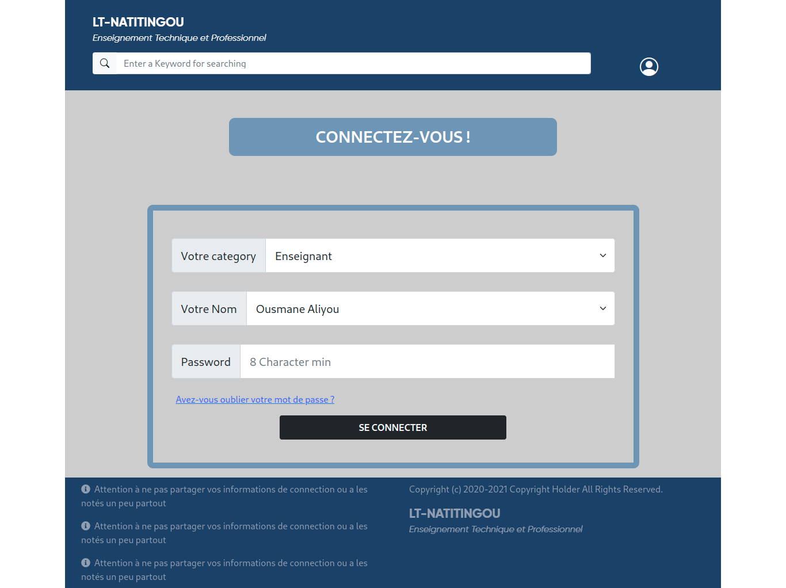

# LtnConduiteApp

A small web application designed for the first time on behalf of the Lycée Technique de Natitingou for the vote of the pipes by teachers for each class.
It is mainly written with the Django framework and using JQuery in Front.
The application is divided into two parts:
  - A first for the school supervisor who can add and edit the list of teachers authorized to vote as well as view the results of the votes and the behavior retained for each class at the end of the votes.
  - A second for teachers, who can select their class and go to the voting stage, as well as the appreciation of the application.


## Installation

Install my-project with GitHub

### Make sure you already have Python3 and Django>=3.2.9 installed on your machine

```bash
  git clone https://github.com/BlakvGhost/LtnConduiteApp.git

```
Unzipp the folder and
```bash
    cd LtnConduiteApp-main
```
start now the server

```bash
    python3 manage.py runserver
```
    
## Default User Login

  You can change the django admin super user or simply create another user by the cmd

  ```bash
      python3 manage.py createsuperuser
  ```

#### For login Form, connect you as "SURVEILLANT"
 
 Password: admin

### For Login in django admin as Super User use:

Password: admin
username: blakvghost
## Screenshots



## Tech Stack

**Client:** HTML5, CSS3, JQuery

**Server:** Django, SQLite

## License

[](https://choosealicense.com/licenses/mit/)
[](https://opensource.org/licenses/)
[](http://www.gnu.org/licenses/agpl-3.0)
